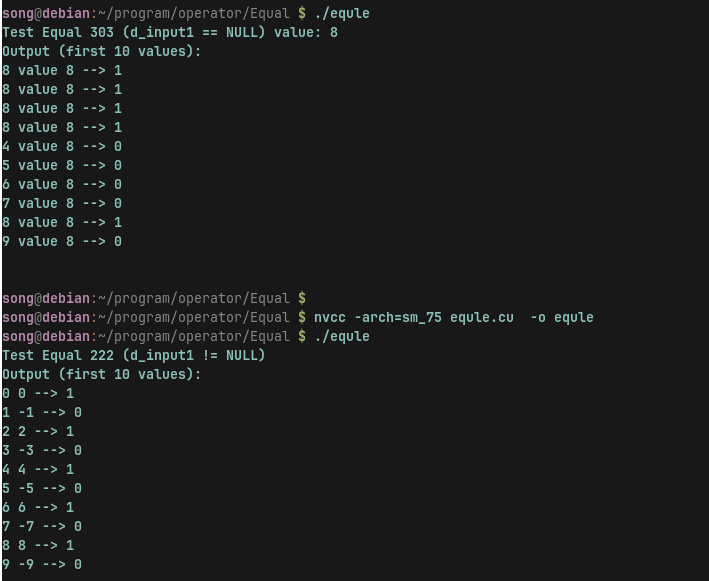

# 算子介绍
Equal 是一个常见的张量（Tensor）操作，用于比较两个张量的对应元素是否相等。

## 基本功能
输入：两个张量（Input1 和 Input2）。
输出：一个布尔类型张量（或整数类型，具体取决于实现），表示对应位置的元素是否相等。
对应位置相等 -> True 或 1
对应位置不相等 -> False 或 0
## 广播机制
如果两个输入的形状不一致，但可以通过广播（broadcasting）规则使其形状匹配，Equal 会自动应用广播。


# Example 1
```cpp
import numpy as np

# 两个张量
A = np.array([1, 2, 3])
B = np.array([1, 4, 3])

# Equal 操作
result = np.equal(A, B)
print(result)  # [ True False  True ]
```


# Example 2
```cpp
A = np.array([10, 20, 30])
B = 20

# Equal 操作
result = np.equal(A, B)
print(result)  # [False  True False]
```

# 算子实现

Equal（input1：2，input2：2， output1：2）实现时核函数名称为Equal222
Equal（input1：3，input2：0， output1：3）实现时核函数名称为Equal303

